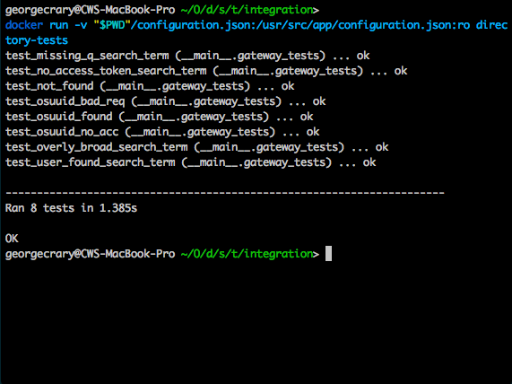

# Directory API Integration Tests

This directory contains files that run integration tests against the Directory API.

First, create a configuration.json file from configuration_example.json.

Next, use these commands to build and run the container. All you need installed is Docker.

    docker build -t directory-tests .
    # Run the integration tests in *nix
    docker run -v "$PWD"/configuration.json:/usr/src/app/configuration.json:ro directory-tests
    # Run the integration tests in Windows
    docker run -v c:\path\to\configuration.json:/c:\usr\src\app\configuration.json:ro directory-tests

Successfully passing all the tests with the command above would output this result:

